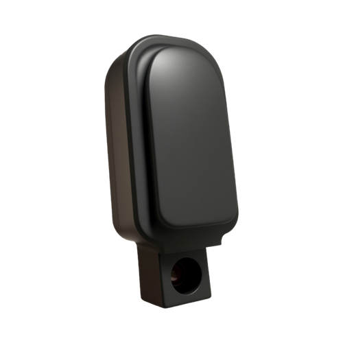
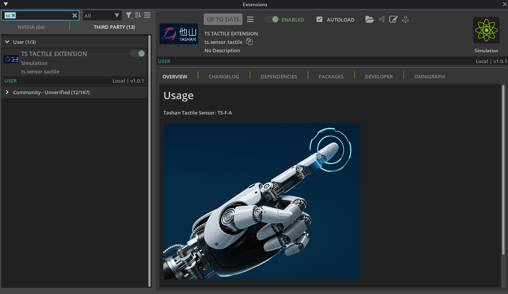

# Tashan Technology Tactile Simulation Platform User Manual

[English](README.md) | [中文](README_zh.md)


## Introduction
Welcome to the Tashan Technology Tactile Simulation Platform! Developed based on Isaac Sim, this platform provides researchers and developers with an efficient, high-precision robotic tactile simulation environment to advance research and innovation in robotic tactile perception technology. Our model is China's first tactile simulation model based on real products, playing a significant role in promoting the development of embodied intelligent robots.<br>



## Feature Overview
- Universal Tactile Sensor TS-F-A, outputting 11 dimensional feature channels:
    - Proximity sensing [1];

    - Tactile sensing [2~4]: Normal force, Tangential force, Tangential force direction (0-359°, with fingertip direction as 0°);

    - Raw capacitance values [5~11]: 7-channel raw capacitance data.


## Workstation Setup
Before using this platform, please ensure your system meets the [Isaac Sim Requirements](https://docs.isaacsim.omniverse.nvidia.com/5.0.0/installation/requirements.html).
- Project based on Isaac Sim 5.0.0: [Download Isaac Sim 5.0.0](https://docs.isaacsim.omniverse.nvidia.com/5.0.0/installation/download.html);

- Workstation installation: [Workstation Installation](https://docs.isaacsim.omniverse.nvidia.com/5.0.0/installation/install_workstation.html);
    ```bash
    # Install visualization dependencies
    cd <isaacsim>
    ./python.sh -m pip install rerun-sdk==0.18.2
    ```

- Download asset packs: [Local Assets Packs](https://docs.isaacsim.omniverse.nvidia.com/4.5.0/installation/install_faq.html#isaac-sim-setup-assets-content-pack) for local and offline use.


## User Guide
Before using the TS TACTILE extension, we recommend familiarizing yourself with Isaac Sim documentation on [Extension Template Generator](https://docs.isaacsim.omniverse.nvidia.com/5.0.0/utilities/extension_template_generator.html) to understand how to create and use extensions.

1. Activate TS TACTILE Extension:
    In the top menu bar, click Window → Extension to open the Extension Manager. Search for "TS TACTILE EXTENSION" in the search bar, then toggle the ENABLED switch to activate the extension, which has been verified on Ubuntu 22.04.<br>
    If you cannot find the TS TACTILE extension, clone this project manually:
    ```bash
    cd <your_workspace>
    git clone git@github.com:TashanTec/Tashan-Isaac-Sim.git
    ```
    Click the menu button (three horizontal bars), select Settings, create a new directory in the right-hand list, and add your workspace folder path.
    Then search for "TS TACTILE EXTENSION" and activate it. To load the extension automatically on platform startup, enable the AUTOLOAD option.<br>
    


2. Test TS TACTILE Extension:
    - LOAD: Click to load the TS-F-A tactile sensor module and cards, and simultaneously launch the data visualization window;

    - RESET: Click to restore to initial state

    - RUN: Click to start real-time output of TS-F-A tactile sensor data to the terminal. The cards will free-fall onto the tactile sensor module

    - STOP: Click to pause simulation and generate a time-series plot of sensor tactile data to verify model accuracy and stability


## Application Scenarios & Examples
1. Tactile Perception Research: Researchers can develop tactile perception algorithms for signal processing, feature extraction, and object recognition

2. Robotic Manipulation Simulation: Simulate dexterous hand tactile perception and manipulation processes to develop and optimize robotic operation strategies

3. Multimodal Sensory Fusion: Integrate tactile perception with vision, audio, and other sensory modalities for comprehensive environmental perception and object understanding


## Frequently Asked Questions
1. Q: Scene loading takes too long or fails during simulation startup.<br>
A: Primarily caused by network issues. We recommend downloading asset packs locally and configuring them as local assets, which can accelerate loading speeds by 10-100x compared to cloud loading.

2. Q: How to add tactile sensors to my own model?<br>
A: First import the tactile sensor module's USD file into your model. Remember the prim_path, Add the path to the range_paths and _touch variables in the ts.sensor.tactile/ts_tactile_extension_python/scenario.py file.


## Contribution & Feedback
We welcome global partners to participate in training and optimizing this platform by contributing technical expertise and innovative ideas. If you encounter issues or have suggestions, please contact us through:
GitHub Repository: Submit issues at https://github.com/TashanTec/Tashan-Isaac-Sim.git.<br>
Email: Contact us at zhangrun@tashantec.com